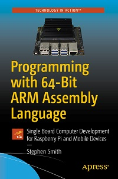

# Apress Source Code

This repository accompanies [*Programming with 64-Bit ARM Assembly Language: Single Board Computer Development for Raspberry Pi and Mobile Devices*](https://www.apress.com/9781484258804) by Stephen Smith (Apress, 2020).

[comment]: #cover

Download the files as a zip using the green button, or clone the repository to your machine using Git.

## Releases

Release v1.0 corresponds to the code in the published book, without corrections or updates.

## Adaptation for Apple ARM64

An adaptation of the sourcecode for the Apple ARM64 Prototype can be found here: https://github.com/below/HelloSilicon

## Contributions

See the file Contributing.md for more information on how you can contribute to this repository.
